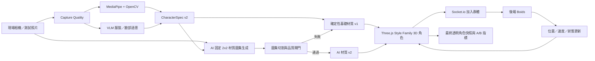

# PersonaFlow 外部研究 AI 技術交接書

> 文件版本：2026-08-01
> 文件用途：讓未接觸過本專案的研究型 AI 或技術顧問，在短時間內理解產品、目前實作與未驗證風險，進一步搜尋並交叉比對現成技術，最後產出可採用性分析與分階段嘗試計畫。
> 本文件中的「已完成」、「目前數據」與「目標」必須分開解讀；不得把預定成果寫成已達成成果。

## 0. 給外部研究 AI 的一句話任務

請研究如何讓 PersonaFlow 建立可擴充的「角色物種／風格族群統一器」：同一 Style Family 生成的所有人必須共享穩定的造型語言、材質、陰影、光線與渲染質感，但仍保留真人的高矮胖瘦、服裝、臉部特徵與個體差異。`brick_v1` 積木風只是第一個 Style Family。請提出能在現有 Flask、OpenCV、MediaPipe、Socket.io、Three.js 架構中逐步驗證，且能達到成熟商業生圖服務視覺品質的獨有方案。

> 名詞說明：專案構想中的「人種風格統一器」是指虛構角色的 **Character Species / Style Family**，不是辨識或分類真人的種族、族裔。本文統一使用「角色物種／風格族群統一器」，避免研究方向被誤解。

---

## 1. 專案到底在做什麼

PersonaFlow 是公共空間互動作品，不是單純的 AI 頭像網站。

參與者在現場拍照後，系統會：

1. 分析人物、服裝、顏色、髮型、眼鏡、鬍鬚與身高比例。
2. 將真人轉譯成同一角色物種與世界觀下的 3D 角色；第一版是 `brick_v1` 積木風，未來可新增其他人物風格。
3. 將角色加入公共投影牆。
4. 由 Boids 群體演算法驅動角色漫遊、相遇、轉身與揮手。
5. 後續預計產生群體合照、QR Code 與整場活動的集體視覺記憶。

產品價值不應只用「單張角色是否漂亮」衡量。真正差異是：

- 穿著被即時轉譯，而不是只套用固定頭像模板。
- 角色會進入同一個持續運作的公共空間。
- 每個人是群體作品的一部分，角色之間會發生互動。
- 原始拍攝影像不在本機長期保存，降低展場的人臉隱私風險。
- 系統追求「像本人當天的穿著與特徵」，不追求寫實人臉複製。

PersonaFlow 的長期產品不是一個固定積木角色產生器，而是一套 Style Family 系統。每個 Style Family 都應定義自己的角色物種、身體語法、材質、陰影、色彩與可變形範圍。

## 2. 問題定義

目前最重要的矛盾是：

- 完整人物 AI 生圖容易有高細節，但會產生身體比例、肢體、姿勢、背景、角色風格與服裝內容漂移。
- 完全程序化 3D 角色很穩定、很快，但細節不足，無法和 Firefly 類成熟影像轉換結果競爭。
- seed 只能在模型、輸入、參數與執行條件相同時提高可重現性，不能單獨保證不同人物都屬於同一角色設計系統。
- 現場體驗不只在意最終品質，也在意等待時間、失敗率、多人同場的 FPS 與角色能否可靠加入群體。

本專案所說的「角色一致性」必須和一般角色生成器的用語分開：

| 一致性類型 | 問題 | 本專案需求 |
|---|---|---|
| 同一人物一致性 | 同一角色在不同圖片中是否仍像同一個人 | 需要，但不是唯一核心 |
| 單張畫面風格一致性 | 顏色、筆觸、陰影是否接近參考圖 | 需要，但 prompt 或 Style Reference 仍可能漂移 |
| **角色物種／族群一致性** | 不同真人轉譯後是否明顯屬於同一套角色設計系統 | **PersonaFlow 的核心研究目標** |
| 個體差異保留 | 同一族群內是否仍能看出高矮、胖瘦、服裝與外觀差異 | **不能被一致性消除** |

例如第一次不能是高陰影、立體塑膠的角色，第二次卻變成平面插畫；所有人必須像「同一物種、同一世界、同一渲染器」產生的人。但一致不代表複製同一個模板：角色仍應有受控的身高、肩寬、軀幹寬度、四肢粗細與體型差異。

這和以 Elser、Firefly 或 identity／character locking 為代表的既有角色一致性需求不完全相同。外部研究 AI 必須先核對各產品實際公開能力，再比較它們是否能處理「跨不同人物的族群收斂」和「族群內個體差異保存」，不能把鎖定同一張臉直接當成答案。

因此正式方向不是「取消 AI 生圖」，而是重新分配 AI 與角色系統的權責：

> 固定 Style Family 的 topology、造型語法、動作與渲染規格；高矮胖瘦由受限參數控制；AI 生成受約束的臉部與服裝材質；驗證失敗時保留可用的基礎材質。

這使 AI 提供商業平台等級的圖像細節，同時由 Style Family 的參數化規格決定骨架、可用體型範圍、肢體與渲染方式。AI 可以協助判讀胖瘦與外觀，但不能自由改寫角色物種的造型語法。

### 2.1 想要達成的效果

- 第一版以積木風人物為主，但架構未來能容納其他 Style Family。
- 不同參與者連續生成後，看起來必須屬於同一角色物種與同一製作系統。
- 每次結果的立體程度、材質、輪廓、陰影、光線、色彩空間與臉部畫法不能任意漂移。
- 角色統一不等於所有人長得一樣；轉譯後仍要保留高矮、胖瘦、肩寬、服裝、髮型、眼鏡、鬍鬚與臉部辨識特徵。
- 服裝需要保留主色、次色、條紋、領口、拉鍊、印花與材質層次，不能只剩大面積純色。
- 角色應具有成熟影像轉換服務常見的細節與 3D 陰影效果，但不能出現多手、多腳、錯誤姿勢、背景殘留或身體結構漂移。
- 拍照後的等待時間要適合現場互動，而不是只追求離線生成的最高畫質。
- 生成完成的角色不是單張圖片，而是可移動、可互動、可長時間存在於公共投影中的角色。
- 多位參與者同時出現在投影牆時，仍要維持同一世界觀並保有每個人的差異。

---

## 3. 目前產品模式

| 模式 | 目前用途 | 生成內容 | 是否為正式主流程 |
|---|---|---|---|
| `brick_ai_texture` | 正式模式 | 共用積木物種語法的 3D 角色 + AI 臉部／服裝材質圖集 | 是 |
| `body_sprite` | 舊流程比較 | AI 生成 2D 身體素材，再由舊渲染器使用 | 否 |
| `full_character` | 視覺上限與 A/B 參考 | AI 生成完整角色圖 | 否 |
| `brick_v1` | 已移除的公開快速模式 | 本機確定性材質 | 否；只保留為正式 AI 完成前的 pending 預覽 |
| `full_character_refined` | 已移除的高成本精修模式 | 完整角色再進行第二次精修 | 否；只保留歷史紀錄相容 |

已移除 `full_character_refined`，原因是成本與等待時間過高，效益不足。
已移除可選的「不呼叫 API 快速備援」，因為它不能代表正式 AI 成果；正式模式的 pending 本機材質不得加入投影，AI 失敗時必須回傳失敗並要求重試。

舊模式值送到後端時會映射為正式模式，避免舊前端或歷史流程直接失效。

---

## 4. 現有技術架構



### 4.1 感知層

- MediaPipe：人體 landmark、姿勢與 segmentation。
- OpenCV：人物區域、服裝區域、主色、遮擋與拍攝品質分析。
- VLM：補充上衣、下身、外套、髮型、眼鏡、鬍鬚等語意。
- 正式與 `body_sprite` 模式中的服裝／臉部 VLM 平行執行，共用約 6 秒 deadline；逾時不能阻止角色建立。

### 4.2 角色資料層

`CharacterSpec v2` 是角色的正式資料介面，包含受限體型參數，而不是一張不可拆解的完整人物 PNG。

```json
{
  "schema_version": 1,
  "material_version": 2,
  "character_id": "uuid",
  "style_id": "brick_v1",
  "height_profile": "medium",
  "skin_color": "#FFD0A8",
  "hair": {
    "style": "short_straight",
    "color": "#3B2314"
  },
  "face": {
    "expression": "smile",
    "glasses": false,
    "beard": "none"
  },
  "outfit": {
    "upper_type": "tshirt",
    "lower_type": "pants",
    "outer_type": "none",
    "upper_color": "#345F8C",
    "lower_color": "#25272B"
  },
  "textures": {
    "face_decal": "data:image/webp;base64,...",
    "torso_front": "data:image/webp;base64,...",
    "left_leg_front": "data:image/webp;base64,...",
    "right_leg_front": "data:image/webp;base64,..."
  },
  "quality": {
    "capture_score": 0.94,
    "texture_confidence": 0.87,
    "ai_texture_status": "enhanced",
    "fallback_used": false
  }
}
```

角色加入群體時儲存完整 spec；一般 `update_positions` tick 只傳位置、速度與狀態，不重送 Base64 貼圖。

目前 schema 只有 `style_id: "brick_v1"` 與 `short / medium / tall` 高度分類，還沒有表達體寬、肩寬、軀幹深度、四肢粗細，也沒有獨立的渲染風格版本。這是現況限制，不代表文件已經決定下一版 schema 要如何設計。

### 4.3 正式 AI 材質流程

目前 `backend/ai_texture_gen.py` 的做法：

1. 程式建立固定 1024 × 1024、2 × 2 的圖集 guide。
2. 將原始照片、角色語意與 guide 交給 Pro image model。
3. 要求模型只繪製四個固定面板：
   - 臉部 decal
   - torso 正面
   - 左腿正面
   - 右腿正面
4. 檢查面板顏色、臉部細節、邊緣密度與基本版面。
5. 通過後切成個別 512 × 512 WebP，臉部背景轉透明。
6. 角色由 `material_version: 1` 熱更新為 `material_version: 2`。
7. AI 失敗或驗證失敗時不產生可加入投影的正式角色，狀態記為 `failed`。

這裡確實有使用 AI 生圖；只是 AI 生成的是角色表面，而不是整個人的幾何與姿勢。

### 4.4 3D 與群體層

- `frontend/projection3d.html` 是目標正式投影牆。
- 目前角色共用固定積木風幾何語法、相機、PBR 材質、燈光與陰影；現階段個體形態只實作三種高度。
- 下一階段應在同一幾何語法內加入受限的體寬、肩寬、軀幹深度與四肢粗細參數，不能為每個人重新生成一套不相容的身體。
- Boids 的 `x/y` 映射為 Three.js 的 `x/z`。
- `ROAMING` 驅動走路；`GREETING` 驅動轉身、停留與揮手。
- 手與腳使用 `THREE.InstancedMesh`；目前池上限為 128 人。
- `frontend/projection.html` 保留為舊 2D／WebGL 失敗備援。
- 聚焦單一角色時，3D 投影頁會擷取透明背景的最終渲染快照，回傳後端做歷史比較。

---

## 5. 已完成、部分完成與尚未證明

### 5.1 已在程式中完成

- 正式 `brick_ai_texture` 模式與舊模式相容映射。
- 版本化 `CharacterSpec v2` 與 `StyleFamilySpec brick_v1 v2`。
- 固定原創 3D 積木風角色與三種高度比例。
- 確定性基礎 WebP 材質。
- AI 2 × 2 材質圖集、分割、透明臉部與材質版本更新。
- AI 完成前的內部 pending 預覽，以及失敗後禁止正式加入的閘門。
- Three.js 角色、PBR 光影、走路、轉向、揮手與 Boids 串接。
- 開發用 SQLite 生成歷史、API attempt、token、cost、驗證與圖片輸出紀錄。
- 同一照片跨模式的匿名 `comparison_id`，不需儲存原始照片。
- 最終渲染細節分數：edge density、Laplacian sharpness、micro-contrast、entropy。
- 主操作頁桌面三欄與較小視窗的緊湊版面。
- 43 個自動測試通過是最近一次已知狀態；交付前仍須重新執行。

### 5.2 已有歷史基準

歷史資料中的生成時間：

| 模式 | 樣本數 | 總耗時中位數 | 生成耗時中位數 |
|---|---:|---:|---:|
| `body_sprite` | 3 | 28.09 秒 | 24.82 秒 |
| `full_character` | 11 | 27.48 秒 | 26.31 秒 |
| `full_character_refined` | 1 | 44.80 秒 | 43.96 秒 |

目前資料庫中的最終渲染細節分：

| 模式 | 有效樣本 | `detail_score` 中位數 |
|---|---:|---:|
| `full_character` | 10 | 0.8415 |
| `body_sprite` | 3 | 0.7970 |
| `full_character_refined` | 1 | 0.8330 |
| 舊 `brick_v1` 本機材質 | 1 | 0.7710 |
| 正式 `brick_ai_texture` | **0** | **無法計算** |

注意：

- `BRICK_V1.md` 的生成時間樣本與目前細節資料的樣本數不同，因為並非每次歷史 run 都成功保存最終 3D 快照。
- 細節分只衡量紋理與邊緣豐富度，不等於「像本人」、「衣服正確」或「角色好看」。
- `brick_v1` 的單一歷史樣本不是目前正式 AI 材質模式。

### 5.3 尚未證明，不能對外宣稱已達成

- 正式 AI 材質流程尚無真人實際生成樣本。
- 正式模式是否達到 `full_character` 的 95% 細節仍無法計算。
- 是否能讓多次生成穩定呈現相同材質、陰影、立體程度與造型語言，而不是在平面插畫和高陰影 3D 之間漂移。
- 是否能在維持族群一致性的同時，可靠保留高矮、胖瘦、肩寬與體型差異；目前只有三種高度，胖瘦尚未實作。
- 是否能穩定保留條紋、拉鍊、領口、印花、裙／褲與左右腿差異。
- 臉部 decal 是否能同時做到辨識度、統一風格與避免 uncanny valley。
- 真人照片到 AI 最終角色的 P50／P95 延遲、成本與 fallback 比例。
- 50／100 人真實貼圖場景的 1080p FPS、GPU 記憶體與 reconnect 恢復。
- CIEDE2000 主色差是否達標。
- 至少 10 位測試者的盲評是否顯著優於舊流程。

若研究或實作需要新的真人生成結果，必須停下並請專案擁有者手動生成、提供結果後再分析；不得自行假設生成結果。

---

## 6. 目前最關鍵的技術瓶頸

### 6.1 缺少可計算的「角色物種合約」

目前 `style_id: brick_v1` 只是一個名稱，還不足以防止以下跨人物漂移：

- 有人是平面插畫，有人是有強烈 PBR 陰影的塑膠玩具。
- 頭身比、手腳粗細、眼睛畫法與輪廓語言不一致。
- 相同膚色或衣服在不同結果中使用不同色彩空間與光照。
- 為了統一而把所有人的身高、體寬與輪廓都壓成同一模板。

目前系統尚未把下列 Style Family 特徵變成明確、可比較的規格，因此無法判斷兩次生成究竟是否仍屬於同一角色物種：

- topology／部件集合與不可變的造型規則。
- 頭身比、肩寬、軀幹寬深、四肢粗細的允許區間。
- 膚色、材質 roughness／metalness、輪廓與色彩空間。
- 固定 camera、environment、key light、fill light、shadow softness 與 tone mapping。
- 臉部特徵的線寬、位置、表情集合與抽象化程度。
- 哪些參數應全族群固定，以及哪些差異來自真人本身。

想要的效果同時包含兩個方向：

1. **族群內聚力**：任取兩個 PersonaFlow 角色，都能判斷來自同一 Style Family。
2. **個體可分性**：任取兩位不同參與者，角色仍能反映其體型、穿著與外觀差異。

### 6.2 通用生圖模型不天然理解 UV 合約

目前 prompt 要求模型遵循 2 × 2 面板，但這只是軟性控制。模型可能：

- 越界、混合面板或改變分隔線。
- 在圖集內畫出完整人物，而不是材質。
- 把 torso 的圖案移到腿部。
- 將透視、陰影或背景烘焙進材質。
- 左右腿不一致，或出現不可用文字。

真正需要研究的是「如何讓模型輸出符合機器可驗證的 canonical material contract」，而不是只改 prompt。

### 6.3 正面單張照片無法提供完整 3D 資訊

照片通常只看到服裝正面。背面、側面、被手臂遮住的圖案不可能可靠恢復。系統應明確決定：

- 背面用程序化延伸、鏡射、純色還是 AI 推測。
- 哪些區域是觀測值，哪些是合理化生成。
- 不確定區域如何在 `quality` 中表達。

### 6.4 細節、忠實度與品牌元素互相衝突

目前正式 prompt 傾向禁止 Logo、文字與數字，能降低文字幻覺與品牌誤植，但也可能刪掉最能辨識穿著的球衣號碼、圖案或胸前標誌。需要制定：

- 幾何圖案可保留到什麼程度。
- 文字是保留、抽象化還是移除。
- 活動主辦方 Logo 是否可放行。
- 哪些品牌元素必須過濾。

### 6.5 臉部 ID 技術不等於角色物種穩定

InstantID、PhotoMaker、PuLID、IP-Adapter FaceID 可提高臉部或參考圖特徵保留，但：

- 不能自動保證固定身體幾何與服裝 UV。
- stylized face 的相似度與可編輯性有 trade-off。
- 部分模型、face encoder 或 checkpoint 有非商用／研究用途限制。
- 加入 identity control 會增加部署、GPU、授權與隱私評估工作。

PersonaFlow 應只把 identity adapter 當作「臉部 decal 候選」，不是整個角色主架構。鎖定某個人的臉，不能保證不同人的結果共享同一頭身比、材質、陰影與造型語法。

### 6.6 現有品質分數容易被高頻雜訊欺騙

edge density、sharpness、micro-contrast 與 entropy 可以量化細節，但錯誤文字、雜訊、接縫與過度銳化也會得到高分。必須新增：

- 材質版面合規率。
- 溢出與接縫分數。
- 原照與材質的服裝區域特徵相似度。
- 主色與次色 CIEDE2000。
- 人工盲評的穿著忠實度與角色一致性。
- 跨人物 Style Family embedding dispersion。
- 幾何語法合規率，以及真實體型排序是否被保留。

### 6.7 遠端生成仍是等待時間與成本主因

歷史完整角色生成約 27–45 秒。把生成範圍縮成材質不保證雲端模型會等比例變快。正式體驗需要分成：

- `time_to_base`：先看到並加入群體的時間。
- `time_to_enhanced`：AI 材質熱更新完成的時間。
- `enhancement_success_rate`：多少人真的得到有效 v2。
- `cost_per_admitted_character`：每位成功加入群體者的成本。

---

## 7. 現有業界與開源技術對照

以下只代表官方公開能力，不代表已在 PersonaFlow 實測。

| 技術 | 官方公開能力 | 與本專案的關聯 | 仍需查證 |
|---|---|---|---|
| Adobe Firefly seed | 相同 seed、prompt 與設定可產生相同／相近結果 | 涉及生成結果的可重現性 | 是否能跨不同人物維持同一角色物種；官方資料並未如此宣稱 |
| Firefly Structure Reference | 用輪廓與深度等結構特徵控制新圖 | 涉及角色結構與構圖控制 | 能否達到 UV 或固定面板的精確版面 |
| Firefly Style Reference | 用參考圖控制風格、顏色、媒材與情緒 | 涉及跨人物畫風與材質一致性 | 是否能固定立體程度、角色物種幾何與多次生成的光影 |
| Firefly Custom Models | 分開訓練 subject／style model | 涉及自訂角色或風格學習 | 資料量、可用 API、成本與跨人物體型保留能力 |
| Scenario LoRA | 以一致圖像訓練 style／character LoRA，可搭配 ControlNet | 涉及專屬畫風與角色概念 | 模型家族限制、資料需求及是否發生體型收斂 |
| ControlNet | 用 edge、pose、depth、segmentation 等條件控制 diffusion | 涉及姿勢、輪廓、深度與版面 | 對材質、色彩、小圖案和物種一致性的控制程度 |
| IP-Adapter | 將參考影像作為 image prompt，可與文字及 ControlNet 組合 | 涉及參考照片特徵保留 | 能否精確保留服裝區域並對位到角色材質 |
| InstantID | 單張照片、免訓練的 ID-preserving generation | 涉及臉部身份保留 | stylized 角色、跨人物物種一致性、授權與部署限制 |
| PhotoMaker | 以 stacked ID embedding 快速個人化，可搭配 LoRA／ControlNet | 涉及人物身份與臉部保留 | GPU、記憶體、UV 材質與非寫實角色的表現 |
| PuLID | tuning-free ID customization，強調 ID 與可編輯性平衡 | 涉及 stylized 人臉 | checkpoint、底模授權、部署與角色物種控制 |
| SAM 2 / human parsing | 提示式分割或人體服裝類別解析 | 涉及人物、衣服、手臂與遮擋區域提取 | 無法直接生成材質，也無法觀察照片中看不到的背面 |
| StreamDiffusion | 在高階 GPU 上進行即時 img2img | 涉及攝影機即時轉譯 | 跨幀一致性、角色持久性與現場硬體需求 |
| Three.js InstancedMesh | 同幾何／材質、不同 transform 時降低 draw calls | 涉及多人 3D 場景效能；目前已使用 | 個人貼圖、材質切換與大量角色的實際效能 |

Elser 等「角色鎖定」產品應列為待研究案例，但在取得官方技術文件前不能假定其核心只靠 seed，也不能直接推論它能解決 PersonaFlow 的角色物種統一。外部研究應實測或查證：

- 它鎖定的是同一人物、同一畫風，還是跨不同人物的共同造型語法。
- 更換真人後，陰影、立體程度、頭身比與部件設計是否仍固定。
- 是否保留高矮胖瘦，或把不同真人都套成同一標準身體。

### 7.1 為什麼不能只抄 Firefly 或角色鎖定工具

成熟生圖平台的目標通常是輸出一張好看的影像。PersonaFlow 還必須處理：

- 所有人共用同一幾何與光影。
- 角色可動、可轉向、可揮手。
- 角色要長時間存在於共享場景。
- 新材質能在不重建角色的情況下熱更新。
- 50–100 人時仍維持可接受 FPS。
- Socket 斷線後可恢復角色資料與狀態。

所以「完整人物生成」只能做品質上限參考，不能直接成為正式資料模型。PersonaFlow 要控制的是一整群不同角色的統計分布：既不能散成不同畫風，也不能塌縮成同一個人。

---

## 8. 外部研究 AI 的研究範圍

本節不預設 PersonaFlow 應採用哪一條技術路線。外部 AI 的工作不是只列出工具名稱，而是要完成「搜尋、查證、交叉比較、判斷可採用性、規劃後續嘗試」的完整研究。

最終輸出必須回答兩件事：

1. 現成技術中，哪些能力可以直接或經過有限整合後用於 PersonaFlow？
2. 依據不同來源的證據，PersonaFlow 接下來可以依什麼順序嘗試、每次要驗證什麼，以及失敗後如何判斷下一步？

### 8.1 必須搜尋的資料類別

#### A. 相似產品、網站與現場體驗

搜尋與 PersonaFlow 相近的：

- AI Photo Booth、真人轉角色網站、活動現場 avatar、公共投影互動作品。
- Elser、Adobe Firefly、Scenario、Ready Player Me 類角色建立或角色鎖定服務。
- 拍照後約 10–20 秒產生結果的商業流程。
- 多位參與者角色會共同出現在同一場景的產品或研究。

每個案例至少查明：輸入方式、輸出形式、生成時間、是否保留人物特徵、是否支援不同體型、是否能跨人物維持同一角色物種，以及公開資料有沒有揭露核心技術。

#### B. 生成式 AI 的一致性與控制

搜尋並區分：

- seed／deterministic inference。
- Style Reference、Structure Reference、character reference、subject reference。
- Style LoRA、Character LoRA、Custom Style Model、Custom Subject Model。
- ControlNet、T2I-Adapter、IP-Adapter、InstantID、PhotoMaker、PuLID 或後續同類方法。
- masked image editing、inpainting、image-to-image、reference-guided generation。
- 多張不同人物輸入時的共同畫風控制、群體角色一致性與跨樣本 style drift。

研究必須說明每項技術控制的是 identity、style、structure、pose、material 還是 body shape，不能把不同問題混成「角色一致性」。

#### C. 人體體型與參數化 3D 角色

搜尋：

- 單張影像人體量測、monocular human reconstruction、body shape estimation。
- SMPL／SMPL-X、DensePose、parametric avatar、morph target、blend shape。
- 身高、肩寬、軀幹寬度、體型與四肢比例的正規化方法。
- stylized avatar 如何把真人比例映射到同一角色物種，而不把所有人變成相同模板。
- 非寫實角色的 body-shape retargeting、骨架共用與動畫相容性。

需特別查明：這些技術從單張正面照片真正能量測什麼、哪些只是推測，以及寬鬆服裝和拍攝透視會造成什麼誤差。

#### D. 服裝理解與角色材質產生

搜尋：

- human parsing、garment segmentation、fashion parsing、服裝類型辨識。
- landmark-to-UV、DensePose UV、texture transfer、texture baking、neural texture synthesis。
- 單張照片轉 canonical UV、角色 texture atlas 或透明 RGBA layer。
- 衣服條紋、領口、拉鍊、印花、文字與材質細節保存。
- 遮擋、側面與背面不可見區域的處理方式。
- virtual try-on、garment transfer、3D garment reconstruction 中可轉用的技術。

#### E. 3D 風格、材質、燈光與多人網頁渲染

搜尋：

- 如何固定 stylized character 的材質語言、PBR 參數、tone mapping、輪廓、燈光與陰影。
- glTF／GLB、共用骨架、morph targets、材質變體與動畫 retargeting。
- Three.js 的 InstancedMesh、texture atlas、texture array、材質 batching 與 cache。
- 50–100 個角色各有個人貼圖時的 draw calls、GPU memory、FPS 與 WebGL 相容性。
- 角色材質熱更新以及 Socket 斷線重連後的資產恢復方式。

#### F. 速度、成本與部署

搜尋：

- 商業 API 與本機模型的實際生成延遲、冷啟動、併發與價格。
- distilled／turbo／LCM 類加速、StreamDiffusion 或後續即時生成技術。
- Windows、本機 GPU、雲端 GPU、混合式流程與離線能力。
- background generation、progressive reveal、base-to-enhanced 更新的現成實作模式。
- 模型 VRAM、磁碟大小、授權與供應商鎖定。

#### G. 評估角色物種一致性與個體差異

搜尋：

- style consistency、cross-sample consistency、population-level character consistency 的研究與指標。
- CLIP、DINO／DINOv2、LPIPS、perceptual similarity、region-level similarity 的適用性與限制。
- 服裝顏色、圖案、臉部特徵與體型保存的評估方法。
- Style Family cohesion、individual separability、style drift、identity drift 與 body-shape mode collapse。
- 自動指標和人工盲評之間的相關性，以及高頻雜訊使細節分數失真的問題。

### 8.2 參考資料與交叉查證規則

外部研究不能只依賴單一公司、單一模型或單一文章。必須：

- 優先使用官方 API 文件、官方 model card、官方 repository、原始論文與作者專案頁。
- 每個關鍵結論至少引用一個第一手來源；若存在獨立研究、benchmark 或可重現測試，再加入第二個不同來源交叉確認。
- 整份報告至少涵蓋四個不同組織或技術團隊，不得只比較同一供應商旗下服務。
- 商業平台展示、官方速度數字、論文 benchmark 和社群實測必須分開標示，不能直接互相比較。
- 記錄來源發布或更新日期、模型版本、測試硬體、輸入解析度與推論設定。
- 若不同來源結論衝突，列出衝突原因，不要自行選一個數字當成事實。
- 若 Elser 或其他產品沒有公開核心技術，清楚標示「未公開／只能由產品行為推測」，不得把推測寫成已證實技術。
- 每個比較表格的主要能力、速度、成本與授權結論都要有可追溯連結。
- 不得用搜尋摘要、SEO 彙整文或無來源宣傳文作為唯一證據。

### 8.3 每項技術都要查明的限制

1. 每個技術的最低 VRAM、Windows 支援、單張延遲、冷啟動與併發能力。
2. API 或開源模型／checkpoint／face encoder 的商用授權限制。
3. 真人照片傳送到第三方服務時的保存政策、訓練使用政策與刪除機制。
4. 技術是否支援本機部署、離線執行或背景處理。
5. 公開展示結果是否來自一般 API，還是需要平台內部模型、人工挑選或多次重試。

### 8.4 外部 AI 最終需要生成的內容

最終產物是一份「技術研究與後續嘗試規劃」，不是單純的連結清單。至少需要包含：

1. **專案理解摘要**
   - 用自己的話說明 PersonaFlow、目前正式流程、真正瓶頸與想要的效果。
   - 明確區分已完成、尚未驗證與未實作功能。

2. **相似產品與網站比較**
   - 列出產品名稱、連結、輸入、輸出、速度、角色一致性類型、體型差異、公開技術與限制。
   - 說明它們和 PersonaFlow 的相似處及根本差異。

3. **現成技術地圖**
   - 依感知、體型、生成控制、服裝材質、3D 渲染、速度和評估分類。
   - 每項技術寫出輸入、輸出、模型／API、硬體、速度、成本、授權、成熟度與來源。

4. **多來源綜合判讀**
   - 不只摘要各來源，而要說明哪些證據彼此支持、哪些互相矛盾。
   - 清楚標示官方宣稱、論文結果、獨立實測、合理推論與未知資訊。

5. **PersonaFlow 可採用性分析**
   - 說明哪些能力可以直接整合、哪些需要轉接、訓練資料或自行研發。
   - 對應目前的 Flask、MediaPipe、OpenCV、CharacterSpec、AI atlas、Three.js 與 Boids。
   - 不得只以「效果最好」選擇技術，還要考慮一致性、個體差異、延遲、成本、GPU、授權與現場可靠性。

6. **至少兩到四條候選路線**
   - 每條路線需說明使用哪些現成技術、資料流、保留哪些現有模組、需要新增什麼能力。
   - 列出優點、缺點、風險、依賴、成本與最可能失敗的地方。
   - 比較後提出排序，但不得在缺乏證據時假裝只有一個正確答案。

7. **分階段嘗試計畫**
   - 從最低成本的技術驗證開始，再進入需要模型、API、資料集或 3D 資產的階段。
   - 每個嘗試都要包含：研究假設、採用技術與版本、需要的輸入、預期輸出、對應 repo 檔案、安裝／API 條件、預估時間與成本、驗證方式、成功條件、失敗條件及下一個分支。
   - 說明哪些嘗試只需合成資料或既有歷史資料，哪些一定需要真人照片與實際生圖。
   - 安排結果比較方式，避免不同照片、不同參數或不同硬體造成無效比較。

8. **最終研究結論**
   - 指出最值得先嘗試的路線及理由，但同時保留第二選擇與切換條件。
   - 列出目前仍缺少、必須由實測才能取得的資訊。
   - 提供清楚的下一步清單，讓專案擁有者能決定要先執行哪個嘗試。

### 8.5 真人生圖停止點

如果研究、比較或後續嘗試需要新的真人生圖結果：

1. 先列出需要專案擁有者操作的模式、照片條件、生成參數與要保存的輸出。
2. 明確標記 `USER_MANUAL_GENERATION_REQUIRED`。
3. 停止假設後續結果，等待專案擁有者手動生成並提供結果。
4. 取得結果後才能進行視覺比較、評分或下一階段規劃。

不得自行捏造真人生成品質，也不得用其他展示圖代替 PersonaFlow 的實際結果。

### 8.6 研究內容不能出現的錯誤

- 把 seed 描述成跨人物風格一致性的完整解法。
- 把同一人物的 identity locking 當成跨人物角色物種統一。
- 為了統一風格而把所有人套成同一身高與體型。
- 用宣傳頁的展示圖直接推論實際 API 品質或速度。
- 未檢查 license 就宣稱可用於公開或商業展示。
- 把 `full_character_refined` 當成仍存在的正式模式。
- 假設正式 AI 材質已經通過真人測試。

---

## 9. Repo 對照表

| 檔案 | 目前責任 |
|---|---|
| `backend/app.py` | Socket 事件、模式協調、平行 VLM、正式材質流程、歷史紀錄 |
| `backend/cv_module.py` | MediaPipe／OpenCV 特徵與服裝區域 |
| `backend/vlm_module.py` | 服裝與臉部語意 |
| `backend/character_spec.py` | `CharacterSpec v2`、受限體型與 pending 基礎材質 |
| `backend/style_registry.py` | 現有風格註冊 |
| `backend/height_profiles.py` | 三種高度 profile |
| `backend/ai_texture_gen.py` | 2 × 2 AI atlas、驗證、切圖與材質版本更新 |
| `backend/avatar_quality.py` | 完整角色輸出品質檢查 |
| `backend/detail_quality.py` | 最終渲染細節指標 |
| `backend/generation_history.py` | run／attempt／review／cost／pairing |
| `backend/swarm_logic.py` | Boids 群體運動 |
| `frontend/index.html` | 拍照、模式與狀態介面 |
| `frontend/sketch.js` | 拍攝流程、預覽與 Socket 事件協調 |
| `frontend/projection3d.html` | 正式 3D 角色、動畫、材質與快照 |
| `frontend/projection.html` | 舊 2D 備援 |
| `frontend/dev.html` | 歷史、成本、圖片與 A/B 資料 |
| `backend/tests/` | 目前 43 項自動測試 |

### 本機驗證指令

```powershell
# 後端
python backend/app.py

# 前端
python -m http.server 8000 --directory frontend

# 自動測試
python -m unittest discover -s backend\tests -v
```

頁面：

- 操作端：<http://127.0.0.1:8000/index.html>
- 正式 3D 投影：<http://127.0.0.1:8000/projection3d.html>
- 舊 2D 備援：<http://127.0.0.1:8000/projection.html>
- 開發歷史：<http://127.0.0.1:8000/dev.html>
- 健康檢查：<http://127.0.0.1:5001/health>

---

## 10. 官方與原始資料起點

### 商業生成控制

- Adobe Firefly — [Seeds](https://developer.adobe.com/firefly-services/docs/firefly-api/guides/concepts/seeds/)
- Adobe Firefly — [Structure Image Reference](https://developer.adobe.com/firefly-services/docs/firefly-api/guides/concepts/structure-image-reference/)
- Adobe Firefly — [Style Image Reference](https://developer.adobe.com/firefly-services/docs/firefly-api/guides/concepts/style-image-reference/)
- Adobe Firefly — [Custom Models](https://developer.adobe.com/firefly-services/docs/firefly-api/guides/concepts/custom-models/)
- Scenario — [Training Models / LoRA / ControlNet](https://docs.scenario.com/get-started/training/training-models)

### 開源生成與身分控制

- [ControlNet 官方 repository](https://github.com/lllyasviel/ControlNet)
- [IP-Adapter 官方 repository](https://github.com/tencent-ailab/IP-Adapter)
- [InstantID 官方 repository](https://github.com/instantX-research/InstantID)
- [PhotoMaker 官方 repository](https://github.com/TencentARC/PhotoMaker)
- [PuLID 官方 repository](https://github.com/ToTheBeginning/PuLID)
- [StreamDiffusion 官方 repository](https://github.com/cumulo-autumn/StreamDiffusion)

### 分割與渲染

- Google MediaPipe — [Image Segmenter](https://ai.google.dev/edge/api/mediapipe/python/mp/tasks/vision/ImageSegmenter)
- Meta — [SAM 2 官方 repository](https://github.com/facebookresearch/sam2)
- [Self-Correction Human Parsing 官方 repository](https://github.com/GoGoDuck912/Self-Correction-Human-Parsing)
- Three.js — [InstancedMesh](https://threejs.org/docs/pages/InstancedMesh.html)
